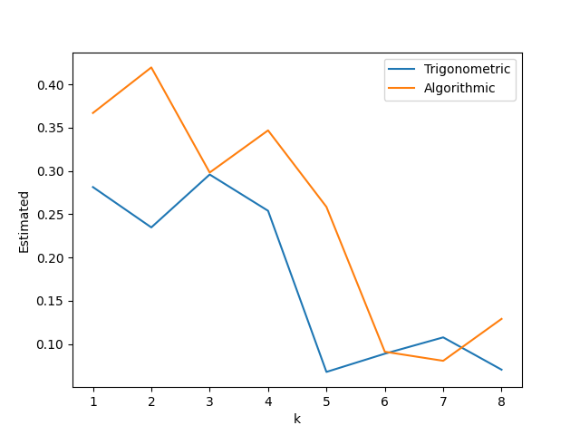
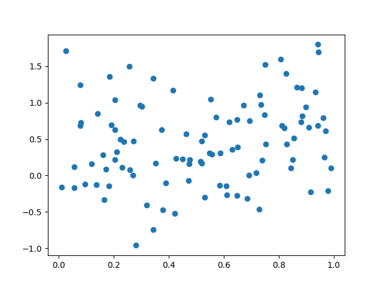
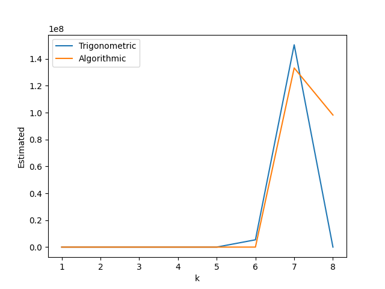

# Predictive learning HW1

## Personal Information

Name: 王重鈞  
ID: 41047025S

## Program Information

Language: Python3.11.4  
Pakcage: Numpy, Panda, Scikit-learn, Matplotlib

## P1

### train error rate in different k in K Nearest Neighbors algorithm

Model: KNeighborsClassifier

Model Assumption: The primary assumption that a KNN model makes is that data points/instances which exist in close proximity to each other are highly similar.

Train Data: obesity_election_2004.csv  
Test Data: obesity_election_2000.csv


Least error rate when k = 7  
Resample error rate with k = 7: 0.2156862745098039  
Test error rate with k = 7: 0.5294117647058824

## P2

Model: NeighborsClassifier  
Train Data: obesity_election_2000.csv  
Test Data: obesity_election_2004.csv

Model Assumption: The primary assumption that a KNN model makes is that data points/instances which exist in close proximity to each other are highly similar.

### train error rate in different k in K Nearest Neighbors algorithm


Least error rate when k = 8
Resample error rate with k = 8: 0.2549019607843137
Test error rate with k = 8: 0.39215686274509803

## Data generate for P3 P4:

```python
def generate_data(size=10):
    xs = np.random.uniform(0, 1, size=size)
    ys = xs**2 + 0.1 * xs + np.random.normal(0, 0.5, size=size)
    return xs, ys
```

## P3

Model: LinearRegression  
Train/Test Data: The data consists of n = 10 samples, (x, y), where x is uniformly distributed in [0,1] and y = x^2 +0.1x+noise and the noise has Gaussian distribution N(0, 0.25). Note that the noise has variance 0.25 or standard deviation 0.5.



Trigonometric Best k: 5  
Trigonometric Best Estimated : 0.06783024545392217  
Algorithmic Bestk: 7  
Algorithmic Best Estimated :: 0.08067735912605192

### Question

> Is it possible to choose the best predictive model, Trigonometric vs. Algorithmic polynomial, using only the result of model selection for each method?

I think the answer is NO. Because the data is only 10 samples. The model would be easy to overfitting. Besides, the noise is huge such as the figure, we hardly to find the func `yx^2 +0.1x`. So, I think we couldn't say Trigonometric or Algorithmic model is better.


## P4

Model: LinearRegression  
Train/Test Data: The data consists of n = 10 samples, (x, y), where x is uniformly distributed in [0,1] and y = x^2 +0.1x+noise and the noise has Gaussian distribution N(0, 0.25). Note that the noise has variance 0.25 or standard deviation 0.5.



Trigonometric Best k: 1  
Trigonometric Best Estimated : 0.3247638822147406  
Algorithmic Bestk: 1  
Algorithmic Best Estimated :: 0.28062363861405615
