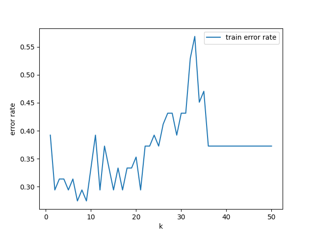
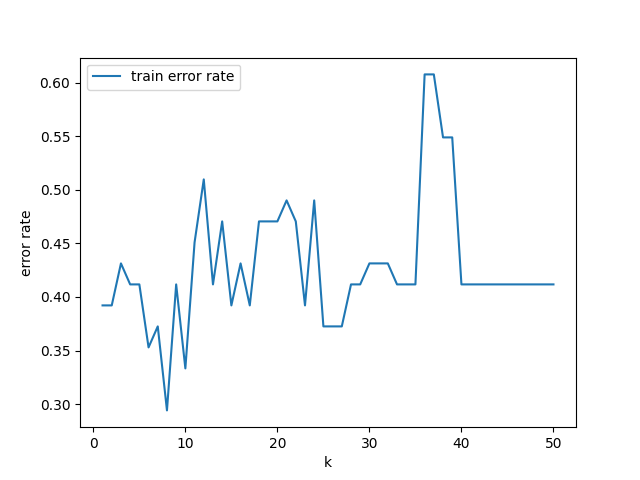
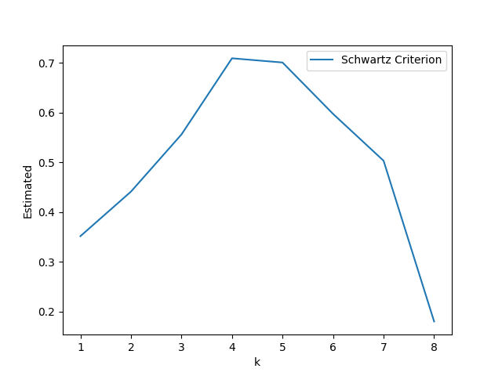
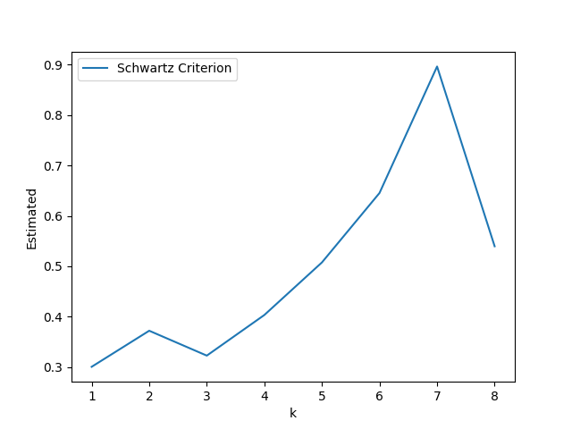

# Predictive learning HW1

## Personal Information

Name: 王重鈞  
ID: 41047025S

## Program Information

Language: Python3.11.4  
Pakcage: Numpy, Panda, Scikit-learn, Matplotlib

## P1

### train error rate in different k in K Nearest Neighbors algorithm

Model: NeighborsClassifier  
Train Data: obesity_election_2004.csv  
Test Data: obesity_election_2000.csv



Least error rate when k = 7  
Resample error rate with k = 7: 0.2156862745098039  
Test error rate with k = 7: 0.5294117647058824

## P2

Model: NeighborsClassifier  
Train Data: obesity_election_2000.csv  
Test Data: obesity_election_2004.csv

### train error rate in different k in K Nearest Neighbors algorithm



Least error rate when k = 8
Resample error rate with k = 8: 0.2549019607843137
Test error rate with k = 8: 0.39215686274509803

## Data generate for P3 P4:

```python
def generate_data(size=10):
    xs = np.random.uniform(0, 1, size=size)
    ys = xs**2 + 0.1 * xs + np.random.normal(0, 0.5, size=size)
    return xs, ys
```

## P3

Model: LinearRegression  
Train/Test Data: The data consists of n = 10 samples, (x, y), where x is uniformly distributed in [0,1] and y = x^2 +0.1x+noise and the noise has Gaussian distribution N(0, 0.25). Note that the noise has variance 0.25 or standard deviation 0.5.




## P4

Model: LinearRegression  
Train/Test Data: The data consists of n = 10 samples, (x, y), where x is uniformly distributed in [0,1] and y = x^2 +0.1x+noise and the noise has Gaussian distribution N(0, 0.25). Note that the noise has variance 0.25 or standard deviation 0.5.
