# Predictive learning HW1

## **P1**

### **Guassian distribution**

I follow the seciton4.4 and Figure4.10, generating the data with Guassian distribution \* 0.2 with **alpha = 1** and **size = 30** first.

```
def generate_pure_data(size=30, normal_distribution=1):
    x = np.random.rand(size)
    y = 0.2 \* np.random.normal(0, normal_distribution, size)
    return x, y
```

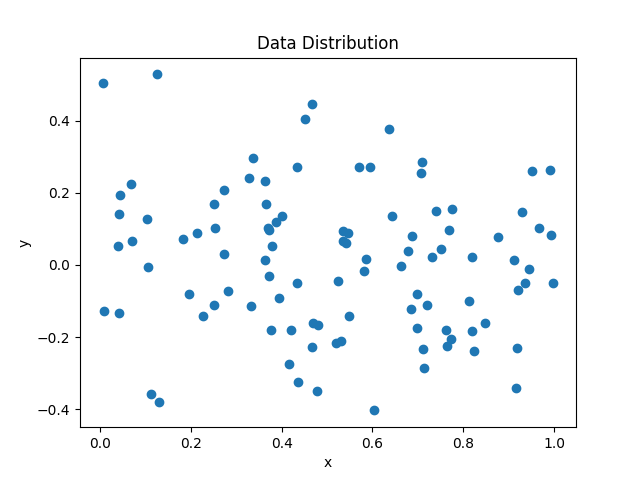

Then using the four method (final predict error, generalize corss-vaildation, VC-based model selection, leave one out corss-vaildation) to selection the model and get their degree and risk(MSE) with 300 times.

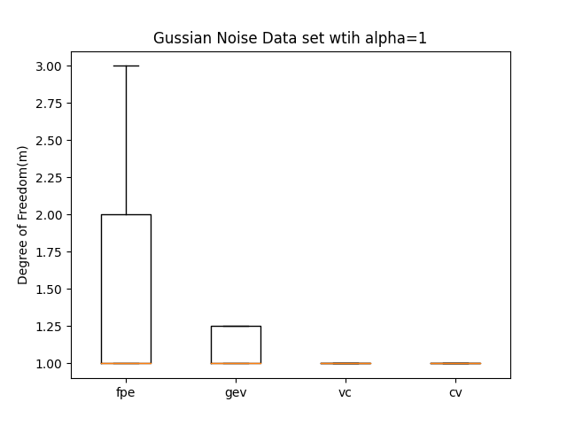

.png>)

We find that the VC-based model selection provide the lowest risk(MSE) on noise data set and the Dof alomost selection m = 1. So we can conclude that VC-based model selection could select model stably with better model.

### **Sine squared function**

Then, I use different **alpha(0.2 and 1)** noise on Sine squared function as Figure4.11. The data set size increase to 100

```
def generate_sin_data(size=30, normal_distribution=1):
    x = np.random.rand(size)
    y = np.sin(2 * np.pi * x) ** 2 + 0.2 * np.random.normal(
        0, normal_distribution, size
    )
    return x, y
```

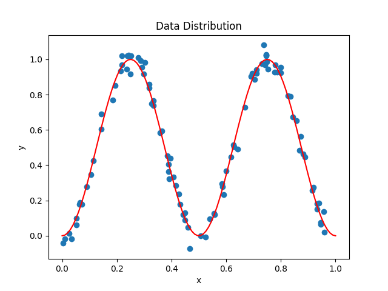
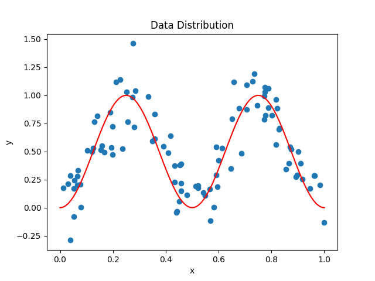

I tried the experience and again and tried with 300 times and plot the Degree and Risk(MSE).

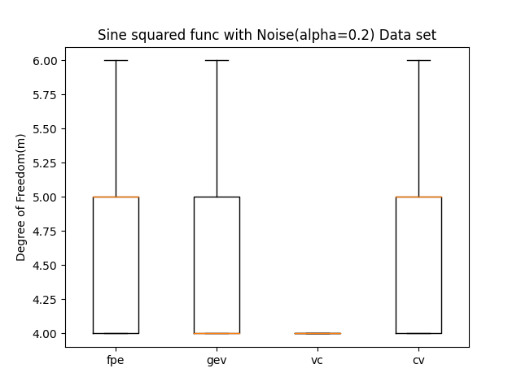
.png>)
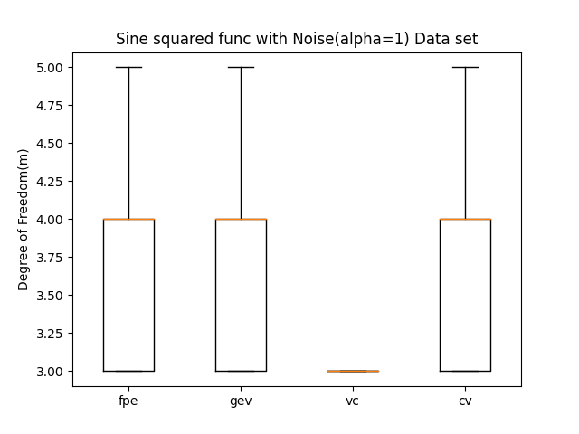
.png>)

We can find the most of model selection Risk(MSE) are decreasing, but the VC-based model selection still be the lowest Risk(MSE)in average. Besides, the Risk(MSE) in VC-based model selection, it has more close Risk(MSE), it mean VC-based model selectio is stable. In totally, even in function target task, VC-based model selection performence still better than other model selection. Although when noise increasing, VC-based model selection has great selection ability than other model selection.

## **P2**

### **Data preprocessing**

After remove missing date, and ignore all weekend, We have 241 training data set and 243 testing data set. And we can plot the data set with up/down in GSPC and EURSUD feature. The color mean it's inceasing or decreasing in FIRGRX.

Train Data:
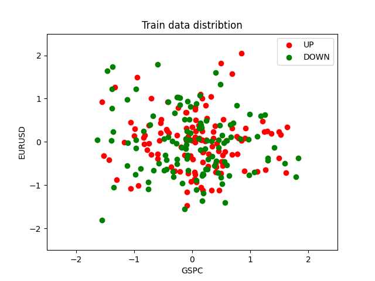
Test Data:
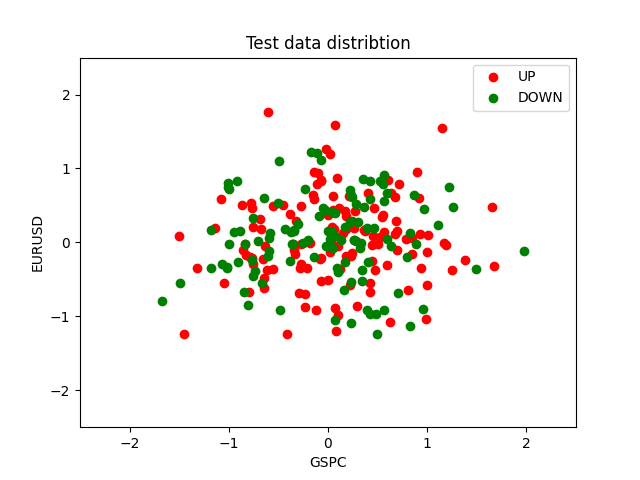

We can find the data is almost mess.

### **Training**

Then I use linear model to train the model and draw the decision boundry.

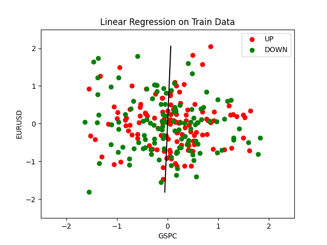
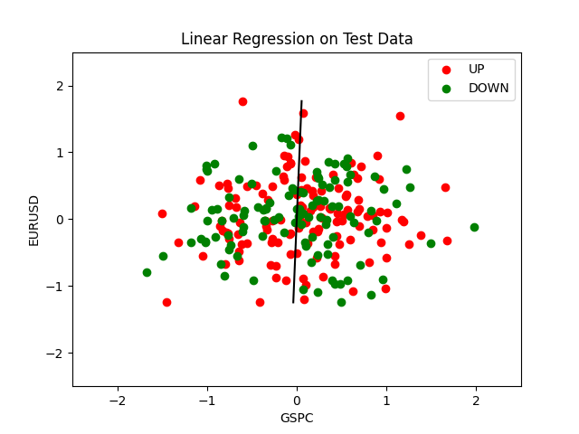

We found that the linear can't hardly class the up and down data.

Then I also train quadratic model, and here is their train_error and test_error:
||Linear|Quadratic|
|:-:|:-:|:-:|
|train_err|7.80241774728163e-05|7.449699704484e-05|
|test_err|4.988108490904661e-05|5.103032457692675e-05|

Then, we use our two models and use on train dataset(2004).

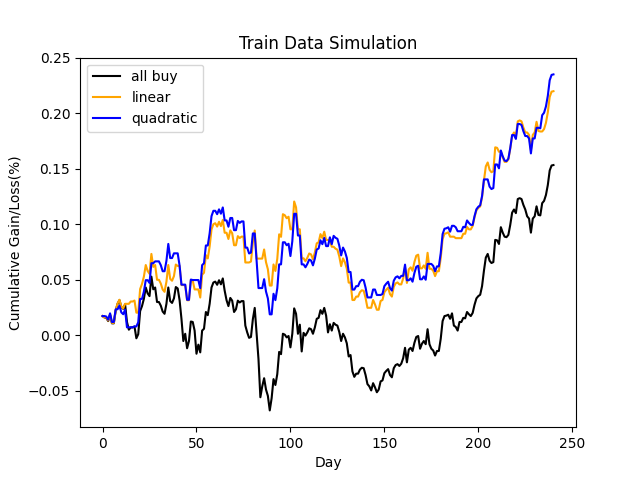
We found that the linear and quadratic model can earn money more than if we buy and not sell all year. So I think the model has learn some information.

### **Testing**

Then, let try use test dataset(2005).
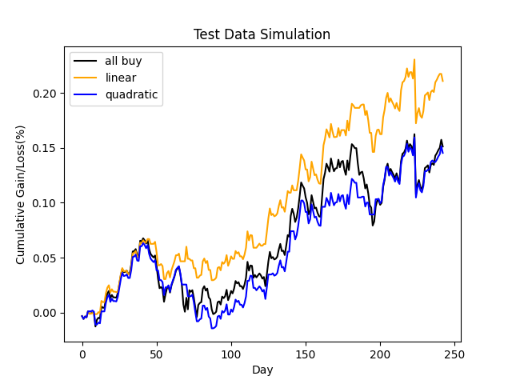
We found that the quadratic model is almost earn same with buy and not sell all year. It indicate the quadratic model would invalid on this task. However, the linear model earn more money than buy and not sell all year, it woudl means the linear model more suitable than quadratic model on this task.

### **Disscusion**

By experience, we found the linear model has better performence on Fidelity International Discovery Prediction Task than quadratic model. Besides, linear model also defeat buy and not sell all year, it means linear model maybe could use on this task. However, I think the dataset is not enough, maybe we need more data to verify the linear model is work.

#### **Can this trading strategy be used in practice? Would you bet your own money using this strategy?**

I think my answer is NO.  
First, the dataset is really small, the model would overfiting if really world is test data.  
Second, the data is mess. In the Figure with train data and test data visualization, the up and down do not have apparently Boundry so that the model can't find a well calssify boundry.  
Third, the feature is lack, in this task, we only having two feature to predict Fidelity International Discovery. However, there would be more feature could affect Fidelity International Discovery.  
According above reason, I think this trading strategy could not be used in practice, and I will never bet my own money on this easy model.

#### **Explain your results using VC-theoretical arguments. Why the learning methods in this HW do not use model complexity control?**

In VC-theoretical, there's VC dimension will be there are many data, and we need separate them with linear, the VC-dim will be the largest which can separate the data. However, We could see data set in visualization. If we want to separate the node, the VC-dim will be largest beacause of messy data. So if we use complexity control I think the model complexity will be large and our computer could handle large Calculation amount.  
And I have another bad thought is that the question is hardly to slove by less data and small model, so it didn't ask you use model complexity control.
