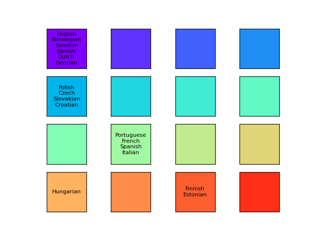
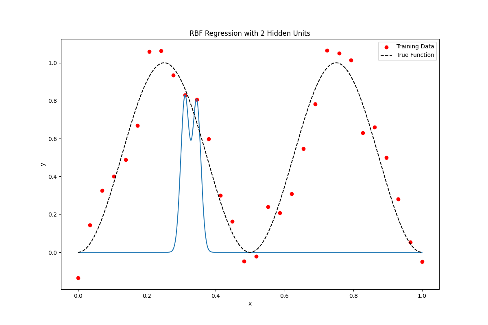
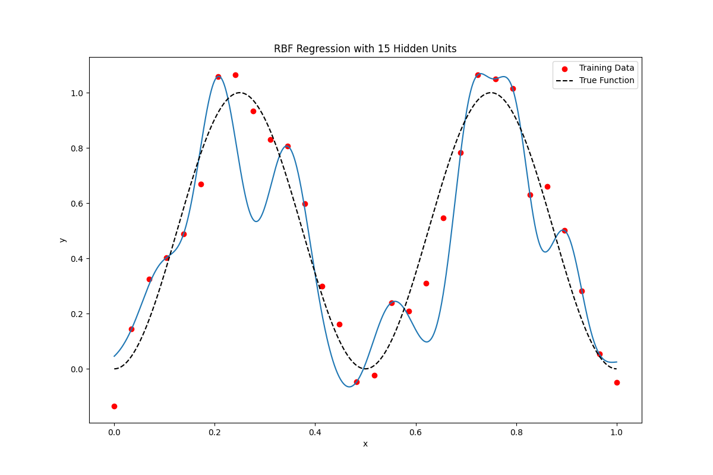
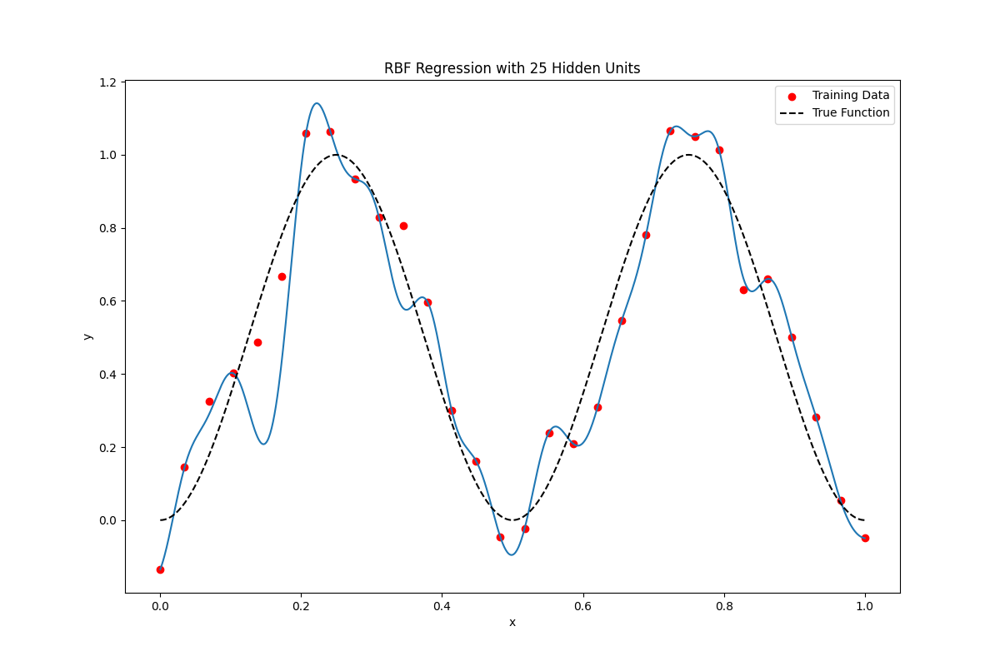
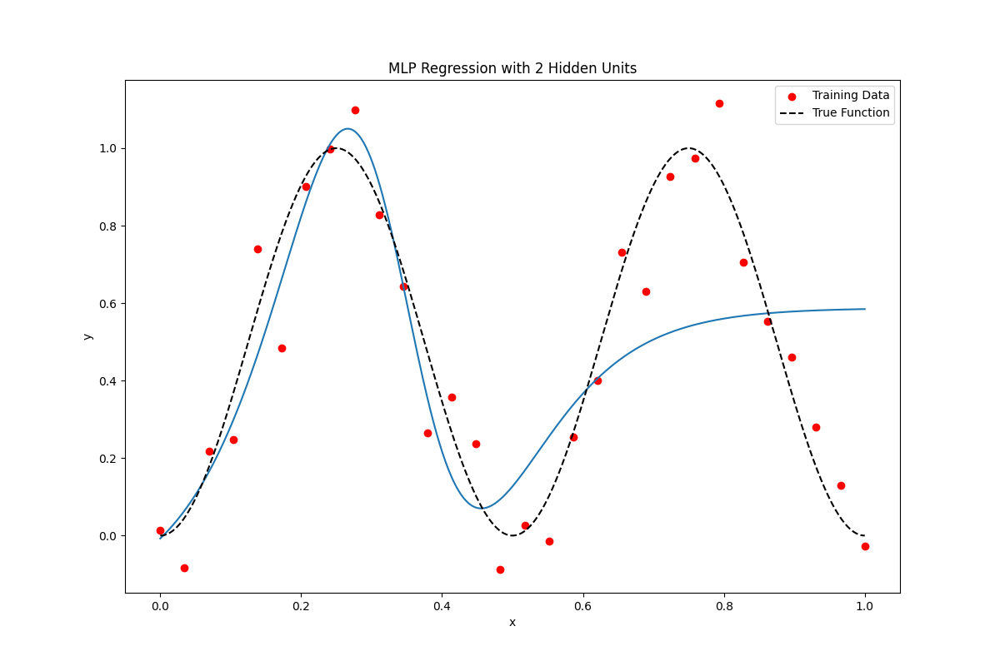
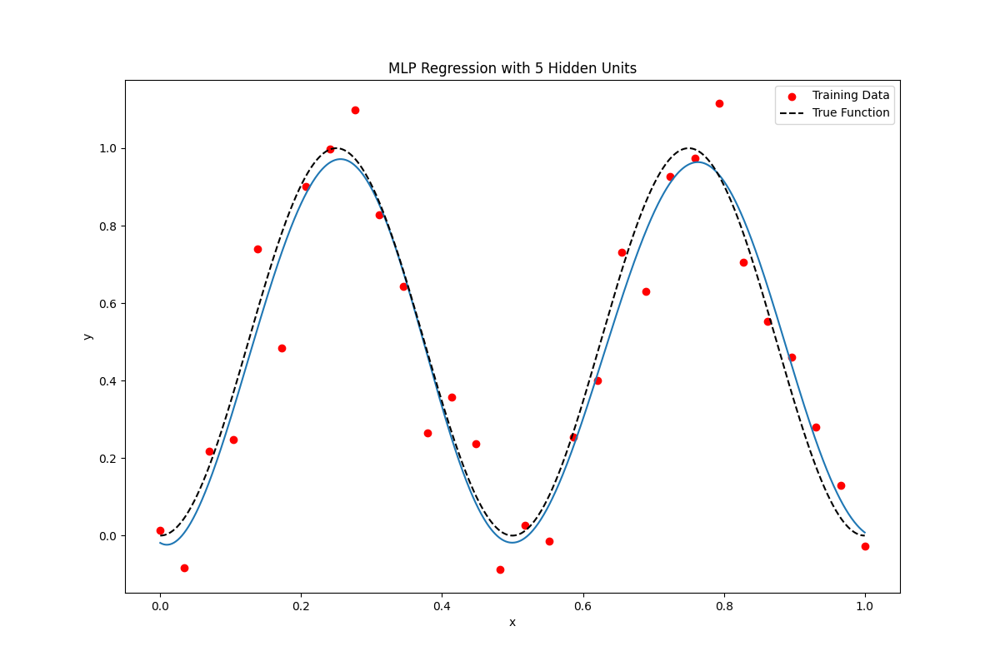

# Predictive learning HW1

## **P1**

Follow the instructions and use SOM, I get this result.

According the result, I marked the countries to anaylsis

We can find, the nearer countries would be classift to same class. It prove our experience is success. And each would be correspond to a country in Middle Ages.

In Iberic peninsula(伊比利半島) and Italy(義大利半島) , there is Portuguese Republic(葡萄牙王國) and Reino de España(西班牙王國) with green.

In North and Middle Europe, there are Kingdom Of France(法蘭西王國) and Kingdom of England(英格蘭王國) with purple.

In Middle Europe, there is Imperium Romanum(羅馬帝國) with blue.

In Hungary, there is Magyar Királyság(匈牙利王國) with orange.

## **P2**

## **P3**

Follow the instruction, I get these result:

Experience with six pictures with RBF, we can find with 2 and 5 neurons, it looks like underfitting. and with 10 neurons, it seem almost fit target function. With 15, 20, 25 neurons, it looks overfitting.

Experience with six pictures with MLP, we can find with 2 neurons, it looks like underfitting. and with 5, 10, 15, 20 neurons, it seem almost fit target function. With 25 neurons, it looks overfitting.

In this experience, we can find that when the neuron less, it will result in underfitting. However, when model become large, it would result in the model overfitting. So, we can use model complexity control to restict our model to prevent overfitting.
