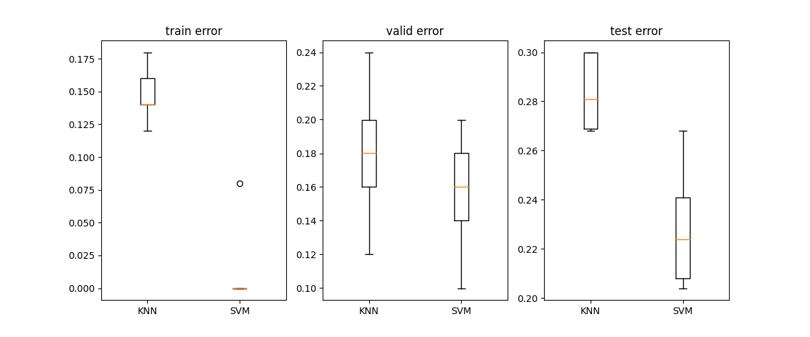
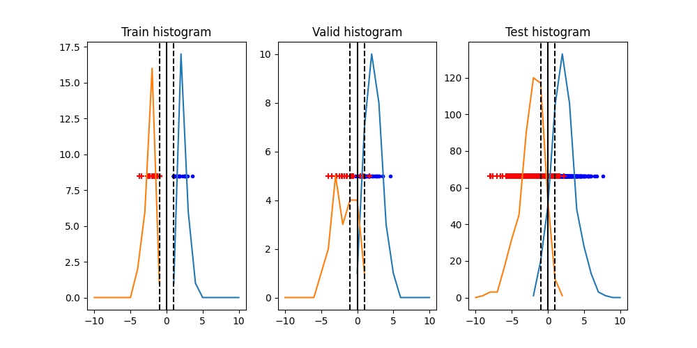
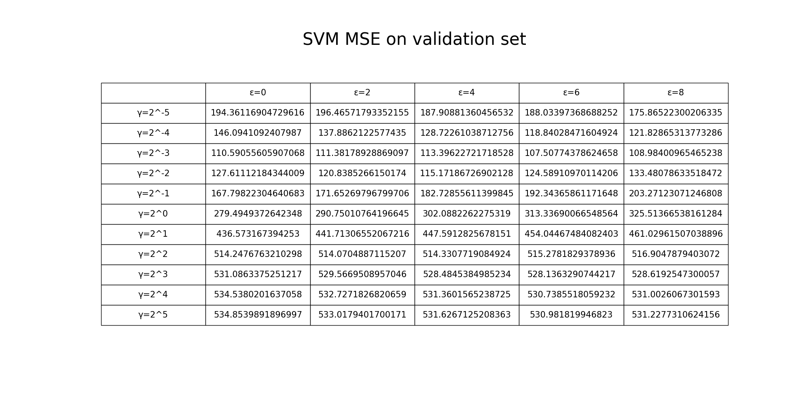
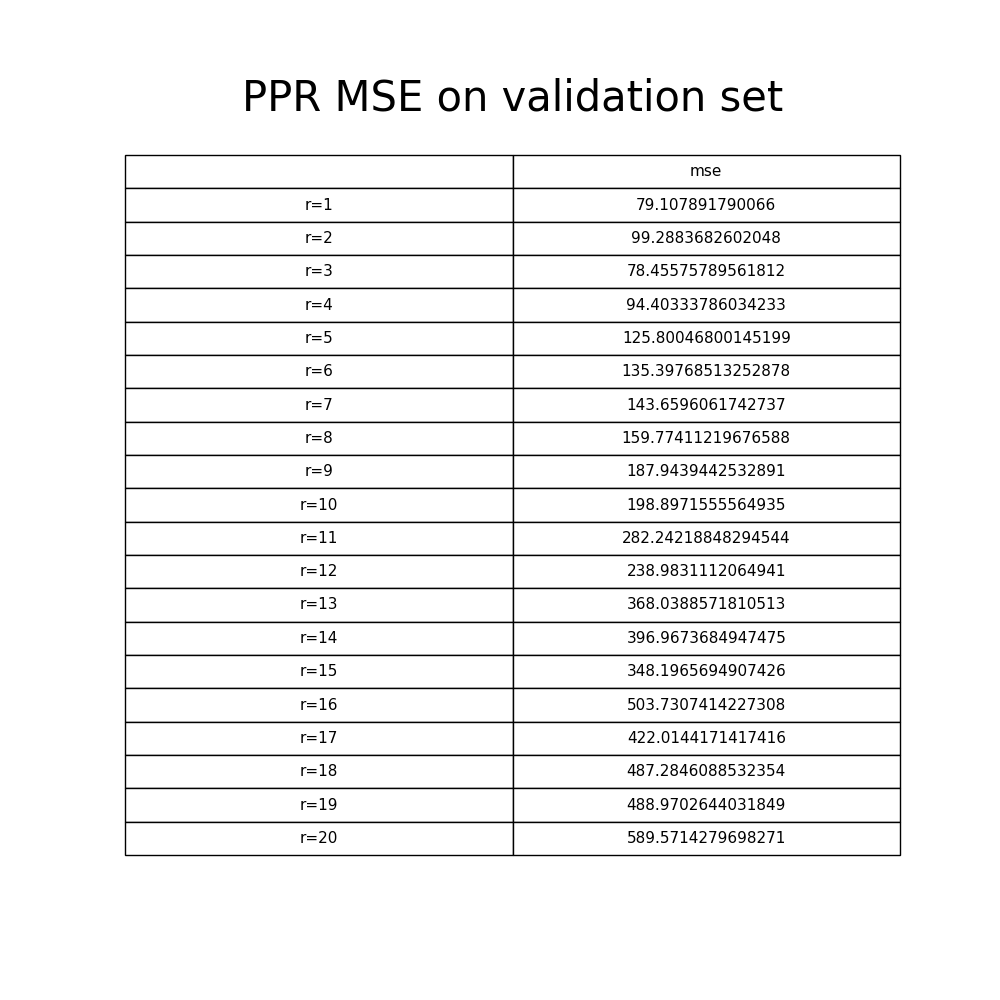

# Predictive learning HW1

## **P1**

### **(a)**

I follow the question, and training with 5 time for each model with validation dataset. KNN model tune k neihbor, and SVM tune c.
Recording the training, validation, testing error with boxplot.

We can find SVM has better performence than KNN algorithm on this dataset. So SVM would be ideal model than KNN on this dataset.

### **(b)**

According to question, I draw histogram-of-projections with SVM model.

By observation, we can find the SV is not large. So the first bound will be better performence on this dataset.

## **P2**

### **(a)**

Following the question, I get the MSE on validation dataset.

According to validation MSE. We selection SVM model with epsilon = 6 and gamma = 2^-3. With this model, the MSE with test dataset is 101.2220405004163 and NRMSEE is 0.3261091899071216.

### **(b)**

I use PPR model with same training dataset, and tune the model compleity with r (The number of terms in the underlying additive model). And record it MSE on vaildation set.

I found the r = 3 is the best model, and the MSE on test dataset with best PPR model is 71.14189790761668 and NRMSE is 0.2721736435450077.

Test error on two model:
||MSE|NRMSE|
|:-:|:-:|:-:|
|SVM|101.2220405004163|0.3261091899071216|
|PPR|**71.14189790761668**|**0.2721736435450077**|

According to table. The PPR model performence is obviously better than SVM model. SVMs might not be effective for data sets which relationships between variables are more complex.
